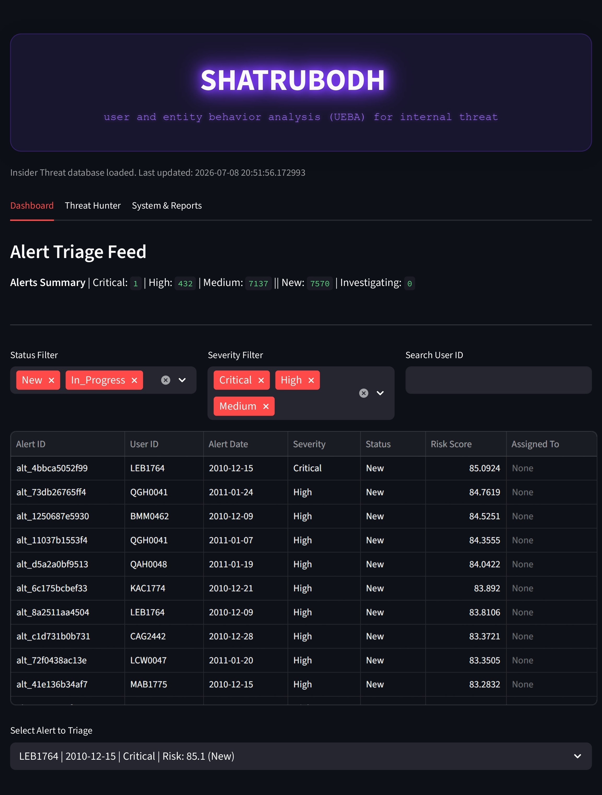
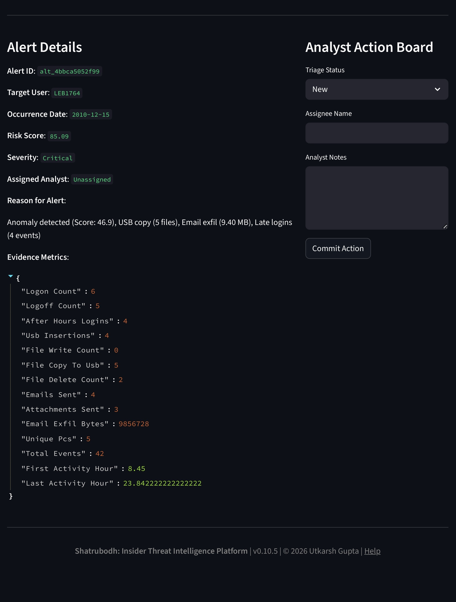
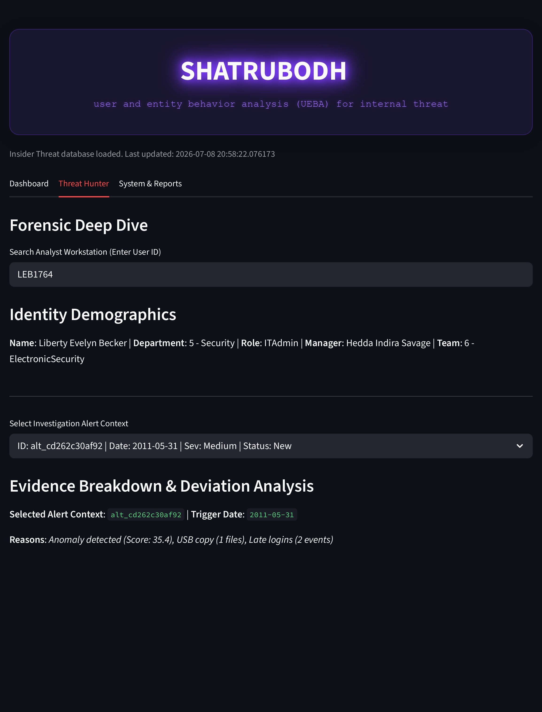
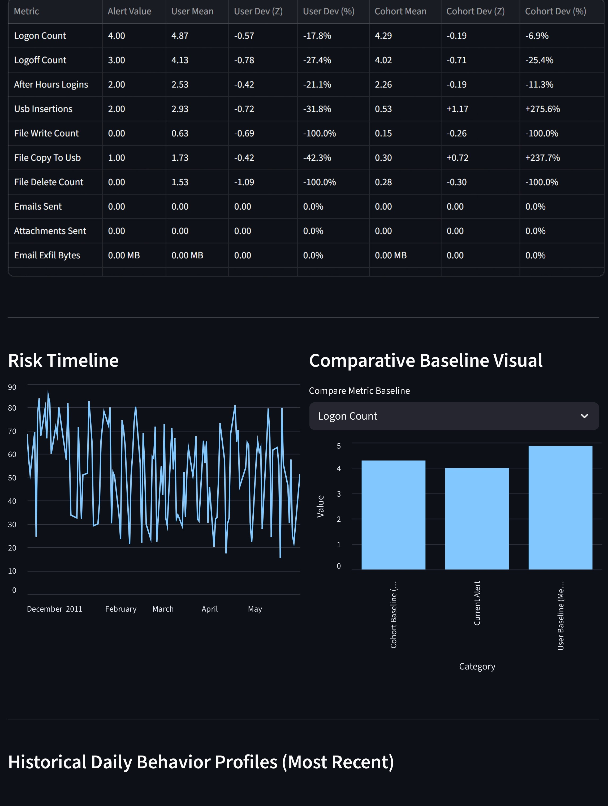
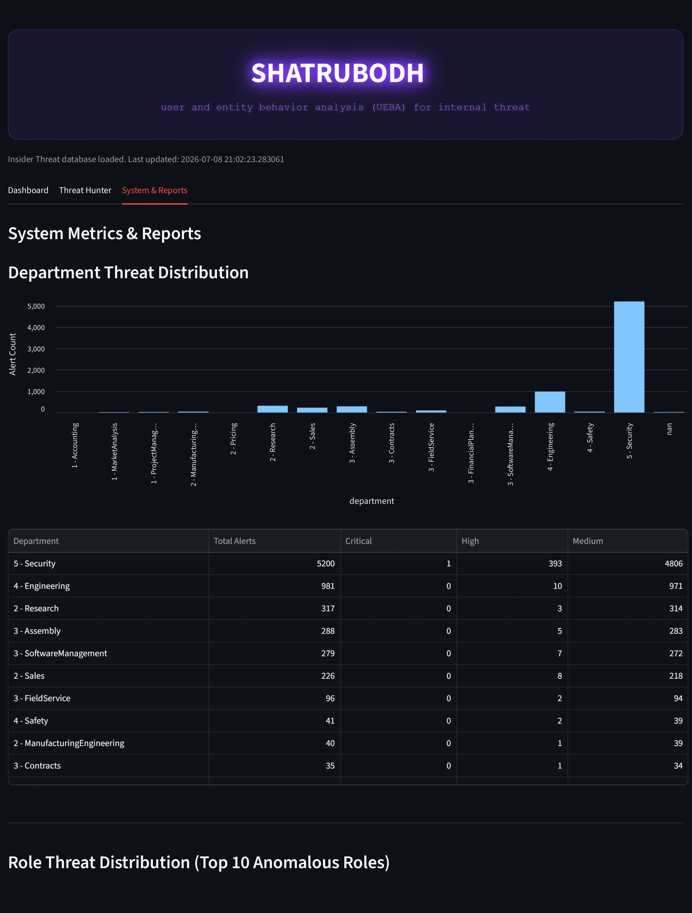
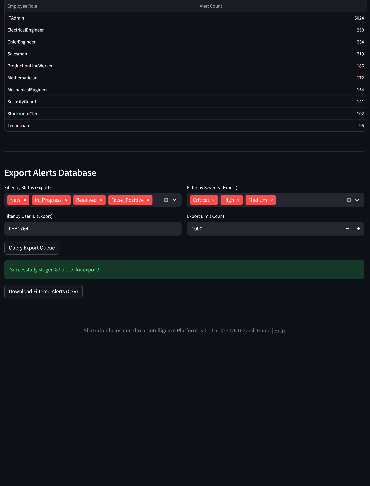

# Shatrubodh

**Shatrubodh** is a production-hardened **User and Entity Behavior Analytics (UEBA)** platform designed to detect insider threats by modelling behavioral baselines, computing contextual risk, and presenting actionable intelligence through an operational Security Operations Center (SOC) dashboard.

---

## Overview

Traditional security systems rely heavily on predefined rules and signatures, making them less effective against trusted users who misuse legitimate access. Shatrubodh addresses this challenge through behavioral analytics, combining unsupervised machine learning with contextual risk scoring to identify anomalous user activity and assist security analysts during investigations.

The platform follows a modular pipeline—from data collection and behavioral profiling to anomaly detection, risk assessment, alert generation, and analyst-driven investigation.

---

## Dashboard Preview

### Alert Triage Dashboard

The operational SOC dashboard provides analysts with a prioritized alert queue, contextual risk scoring, evidence inspection, and investigation workflow.





---

### Threat Hunter

The Threat Hunter enables forensic investigation by correlating user identity, historical behavior, statistical deviations, peer baselines, and longitudinal risk trends.





---

### System Metrics & Reporting

Analysts can visualize organizational threat trends, identify high-risk departments and roles, and export filtered investigation data for reporting.





---

## Core Capabilities

- Behavioral profiling of user activity into daily feature vectors.
- Anomaly detection using **Isolation Forest** and **Local Outlier Factor (LOF)**.
- Context-aware risk scoring through a weighted risk engine.
- Automated alert generation with evidence snapshots.
- Operational SOC dashboard for alert triage and investigation.
- Forensic Threat Hunter with rolling user and peer cohort comparisons.
- Departmental threat analytics and CSV reporting.
- Production hardening, validation, and security auditing.

---

## System Architecture

```text
Raw Security Events
        │
        ▼
Collectors
        │
        ▼
Normalization
        │
        ▼
SQLite Storage
        │
        ▼
Behavior Profile Generation
        │
        ▼
Isolation Forest + LOF
        │
        ▼
Risk Engine
        │
        ▼
Alert Generator
        │
        ▼
SOC Dashboard
```

---

## Technology Stack

| Layer | Technologies |
|-------|--------------|
| Language | Python |
| Analytics | Scikit-learn, NumPy, Pandas |
| Database | SQLite |
| Dashboard | Streamlit |
| Model Serialization | Joblib |

---

## Repository Structure

```text
Shatrubodh/
├── assets/
│   └── screenshots/
├── docs/
│   ├── architecture.md
│   ├── dependencies.md
│   └── project_report.txt
├── src/
│   ├── analytics/
│   ├── collectors/
│   ├── dashboard/
│   ├── feature_engineering/
│   ├── normalizers/
│   ├── schemas/
│   ├── storage/
│   ├── utils/
│   └── app.py
├── LICENSE
└── README.md
```

---

## Dataset

Shatrubodh was developed using the **CERT Insider Threat Dataset**, originally created by the **CERT Program, Carnegie Mellon University**.

The dataset is **not redistributed** with this repository.

For reproducibility, the project uses the same publicly available Kaggle mirror during development:

https://www.kaggle.com/datasets/mrajaxnp/cert-insider-threat-detection-research/

All preprocessing, normalization, feature engineering, and behavioral profile generation performed by Shatrubodh are documented in **docs/project_report.txt**.

---

## Getting Started

Clone the repository:

```bash
git clone https://github.com/utkarshhh0/Shatrubodh.git
cd Shatrubodh
```

Install the required packages using the command listed in:

```text
docs/dependencies.md
```

Launch the dashboard:

```bash
streamlit run src/app.py
```

---

## Documentation

Project documentation is available under the `docs/` directory:

- **architecture.md** — System architecture and module interactions.
- **project_report.txt** — Detailed engineering report.
- **dependencies.md** — Dependency inventory, versions, and installation command.

---

## Validation & Production Hardening

The project has undergone structured validation and production hardening, including:

- Architecture verification
- Database validation
- SQL query auditing
- Exception boundary hardening
- Defensive input validation
- Repository and environment hardening
- Security assessment
- Performance benchmarking

---

## Current Status

**Stable Release:** **v0.10.5**

### Development Timeline

- Phase 1–7 — Core UEBA Platform
- Phase 8 — Operational SOC Dashboard
- Phase 9 — Validation & Security Audit
- Phase 10 — Production Hardening

### Project Status

- Feature Complete
- Security Audited
- Production Hardened
- Repository Hardened
- Version Controlled
- Ready for Evaluation & Demonstration

---

## Roadmap

Future work includes:

- Live log ingestion
- Threat intelligence integration
- SIEM interoperability
- Enhanced behavioral analytics
- Multi-tenant deployment
- Containerized deployment

---

## Author

**Utkarsh Gupta**

---

## License

This project is distributed under a proprietary license. See the **LICENSE** file for licensing terms and usage permissions.